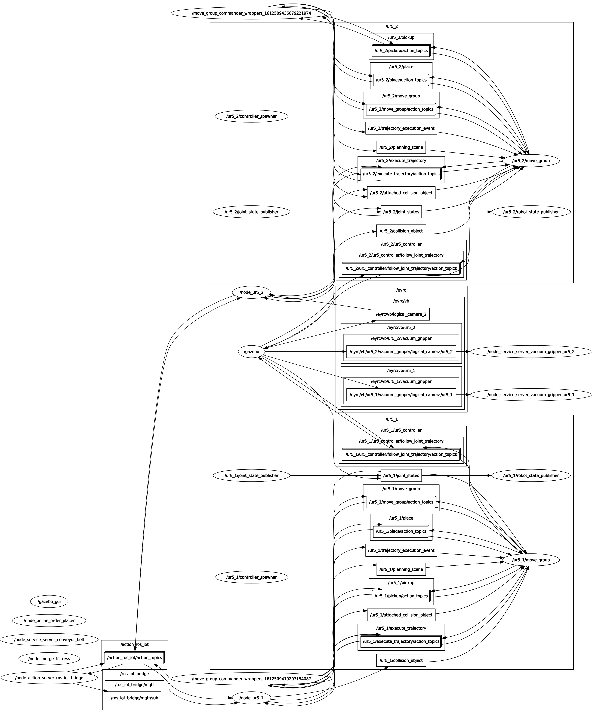

<h1 style="color: red"> <strong>eYRC 2020-21: Vargi Bots (VB#1823) </strong></h1>

## **Introduction**

Theme: Vargi Bots (VB)

The theme is set in the abstraction of a warehouse management system designed in Gazebo, which is a 3D dynamic simulator used to efficiently simulate robots in complex environments.

The arena is an automated warehouse setting where essential packages are required to be sent out to different parts of a city. Since Industry 4.0 heavily focuses on automation here the warehouse will only consist of two industrial robotic arms which will be used. As the requirements are sent to the warehouse, one robotic arm will identify the packages from a shelf and place them on a conveyor belt and the other robotic arm at the end of the conveyor belt will pick these objects from the conveyor and place them into bins. Each bin represents a destination for the package. As the packages are sent out from the warehouse there will also be alerts sent to the user via email notifying them about the package being shipped from the warehouse.

The packages to be delivered have their own priorities. Packages having a higher priority are intended for a natural disaster or a pandemic situation. Other packages with lower priorities are for general purposes.

## **Video of Implementation**

## **Implementation**

* Once all the packages are spawn the Camera#1 which is facing the shelf identifies the package using QR decoding method.
* Once all the packages color are detected the info is loaded to parameter server and the Inventory Management Spreadsheet of the warehouse is updated 
  which will be located on a cloud server using the ROS- IoT bridge developed.
* As the orders are being received by the warehouse, the UR5 #1 Arm starts picking up the packages from the shelf and places it on the conveyor belt one-by-one.
* In case the UR5 #1 has multiple orders of different priorities to process, High Priority orders are processed as quickly as possible,
  then Medium Priority and then Low Priority orders are processed.
* As soon as the packages are placed on the conveyor belt `OrdersDispatched` Sheet of IMS is updated that the order is dispatched also the conveyor belt starts
  and the packages are transported to the other end of the warehouse where the UR5 #2 Arm is mounted. The order dispatched along with package info together is
  loaded into the parameter server aswell
* The UR5#2 Arm identifies the packages with the help of Logical Camera #2 whose input feed is the position of packages on the conveyor belt and segregates the packages
  by picking the package from the conveyor and placing it in the priority corresponding box. 
* As soon as the UR5#2 Arm placess the packages into the box it takes the dispatched info in the parameter server for that pakage and updates the `OrdersShipped` Sheet
  of IMS that the order is shipped.
* As the run is progressing the `Dashboard` Sheet of IMS is updated which serves as JSON end point for the Warehouse Inventory Dashboard and it is updated in real-time.

### **rqt graph**
* At start

* After 1 min

## **API Documentation**

### Project layout

    pkg_task5/
    ├── bag_files
    ├── CMakeLists.txt
    ├── config
    │   ├── rviz
    │   │   ├── ur5_1_planning_scene_with_boxs.scene
    │   │   └── ur5_2_planning_scene.scene
    │   └── saved_trajectories
    │       ├── ur5_1
    |       |   ...     # all the required trajectories for dispatching the packages
    │       └── ur5_2
    |           ...     # all the required trajectories for shipping the packages
    ├── include
    │   └── pkg_task5
    ├── launch
    │   └── task5_solution.launch
    ├── package.xml
    ├── scripts
    │   ├── node_get_package_info.py
    │   ├── node_ur5_1.py
    │   └── node_ur5_2.py
    └── src

    pkg_ros_iot_bridge/
    ├── action
    │   └── msgRosIot.action
    ├── CMakeLists.txt
    ├── config
    │   └── config_pyiot.yaml
    ├── include
    │   └── pkg_ros_iot_bridge
    ├── msg
    │   └── msgMqttSub.msg
    ├── package.xml
    ├── scripts
    │   ├── node_action_server_ros_iot_bridge.py
    │   └── pyiot
    │       ├── __init__.py
    │       ├── __init__.pyc
    │       ├── iot.py
    │       └── iot.pyc
    └── src

### **`pkg_task5`**
This is the ROS package that implements the task.

* **`task5_solution.launch`** - launch file that runs all the required nodes

* **`node_get_package_info.py`** - It waits for all the packages to spawn then loads their color info to parameter server in `/packages_color_info`.

* **`node_ur5_1.py`** - As soon as the `node_get_package_info.py` identifies and loads the packages color info into the parameter server,
  it updates the `Inventory` Sheet of IMS and Updates the `IncomingOrders` Sheet as the orders are received. As the orders are received, it
  Picks and places packages from self to conveyor belt if multiple orders are received it does this based on priority. As soon as the packages
  are placed on the belt it updates the `OrdersDispatched` Sheet and loads the order info corresponding to the package in format: `/packages_dispatch_info/{package-name}`

* **`node_ur5_2.py`** - As the packages move to the centre position or directly above the Camera#2 the conveyor belt is stopped package is picked up by UR5#2 arm and
  dropped into the corresponding box by using color info of the package loaded into parameter server in `/packages_color_info` by `node_get_package_info.py`.
  As soon as the packages re dropped into the bin corresponding order is updated is shipped by updating `OrdersShipped` Sheet by using data in 
  `/packages_dispatch_info/{package-name}` in parameter server.

### **`pkg_ros_iot_bridge`**

This is the ROS package that handels all the IOT related tasks.

* **`msg_Ros_Iot.action`** - Action msg used to receive goal and send feedback and result to the action clients.

        # goal
        string protocol
        string mode
        string topic
        string message
        ---
        # result
        bool flag_success
        ---
        # feedback
        int8 percentage_complete
    
* **`config_pyiot.yaml`** - It contains all the required configuration for iot tasks it is loaded into parameter server at start.

        # config_pyiot.yaml 
        # IoT Configuration
        config_pyiot:
          mqtt:
            server_url: "broker.mqttdashboard.com"  # http://www.hivemq.com/demos/websocket-client/
            server_port: 1883
            topic_sub: "/eyrc/vb/<unique_id>/orders"
            topic_pub: "/eyrc/<unique_id>/ros_to_iot"
            qos: 1

            sub_cb_ros_topic: "/ros_iot_bridge/mqtt/sub"   # ROS nodes can listen to this topic to receive  data from MQTT

          google_apps:
            spread_sheet_id: # Spreadsheet Id/Webapp Id
            submission_spread_sheet_id: # Spreadsheet Id for submission

* **`msgMqttSub.msg`** - This msg format is to publish and subscribe to `sub_cb_ros_topic` which `node_action_server_ros_iot_bridge.py` will use to send mqtt messages to ros topic.  
        
        time timestamp
        string topic
        string message

* **`node_action_server_ros_iot_bridge.py`** - It can accept number of Goals from any number of Action Clients. On receiving appropriate Goal the Action Server,

    1. can push as many data points on a Google Sheet at once.
    2. can publish on any MQTT Topic.
    3. can subscribe to any MQTT Topic and publish the message from MQTT subscription to a ROS Topic `sub_cb_ros_topic` specified in `config_pyiot.yaml` using `msgMqttSub.msg` message file.

* **`iot.py`** - It contains all the necessary functions for IoT Tasks (MQTT & HTTP). It is imported by `node_action_server_ros_iot_bridge.py` for IoT tasks.
